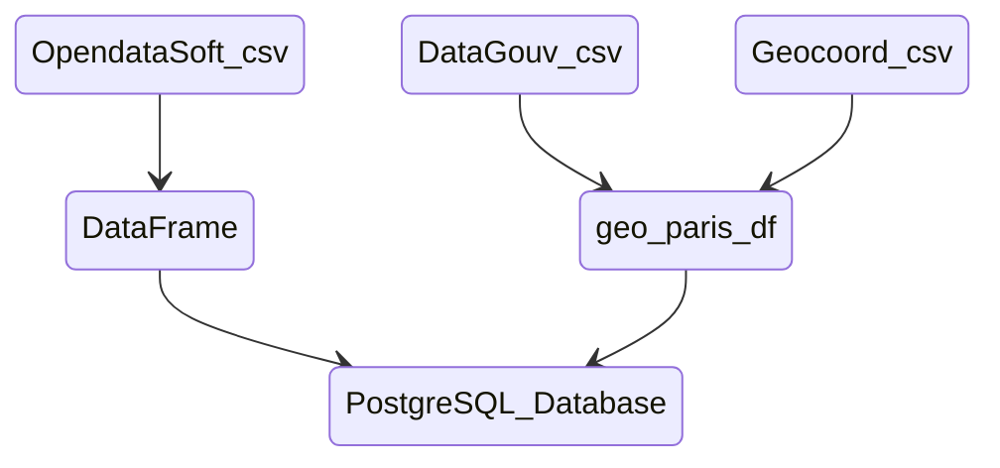

### To view webapp on local system, execute the following commands from inside the project folder  
docker-compose up -d db  
docker-compose up -d datafeed  
docker-compose up -d webapp  

NB: The appropriate .env file with database credentials must be placed inside the root project folder  

Then navigate to localhost on any web browser

### Data processing  

Raw datasource URLs are viewable inside configuration yaml files.

